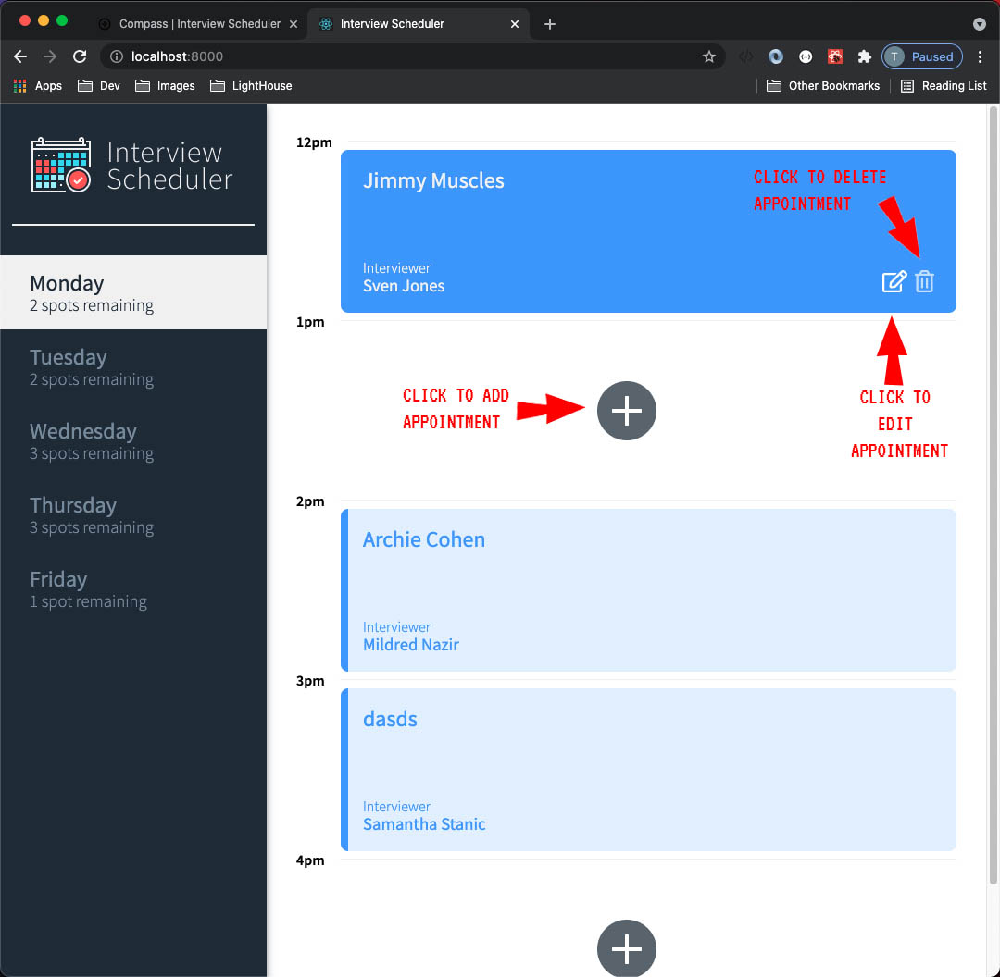
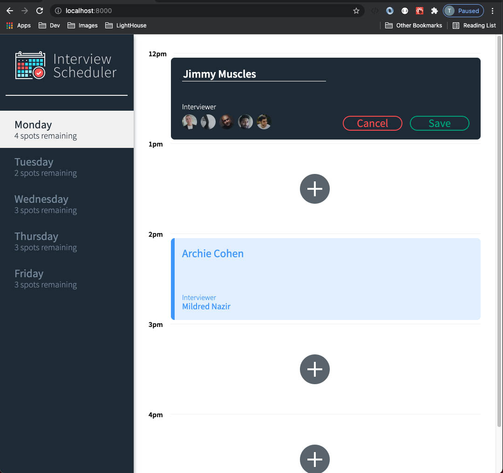
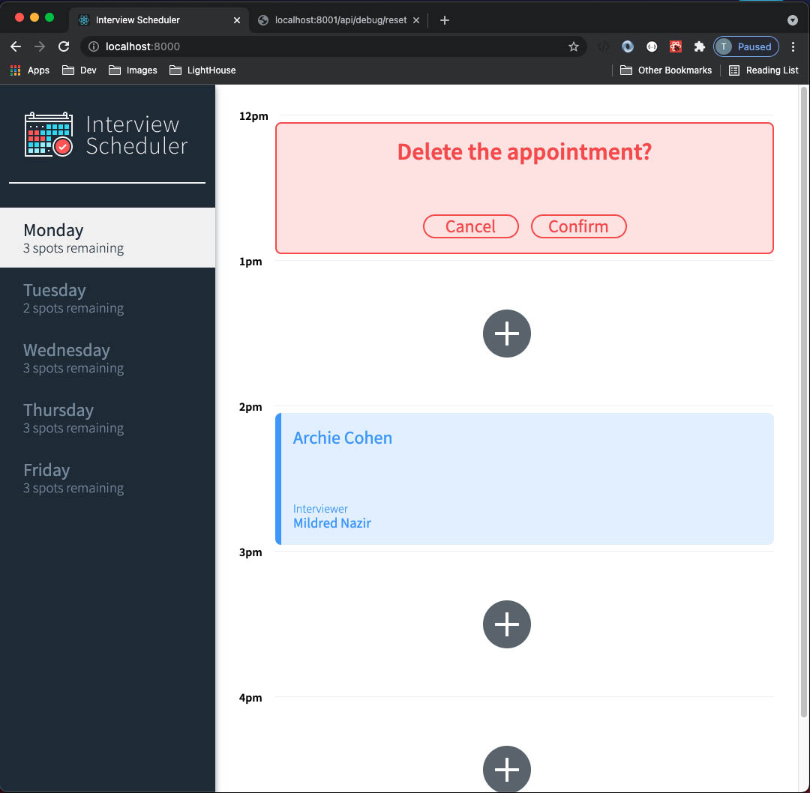
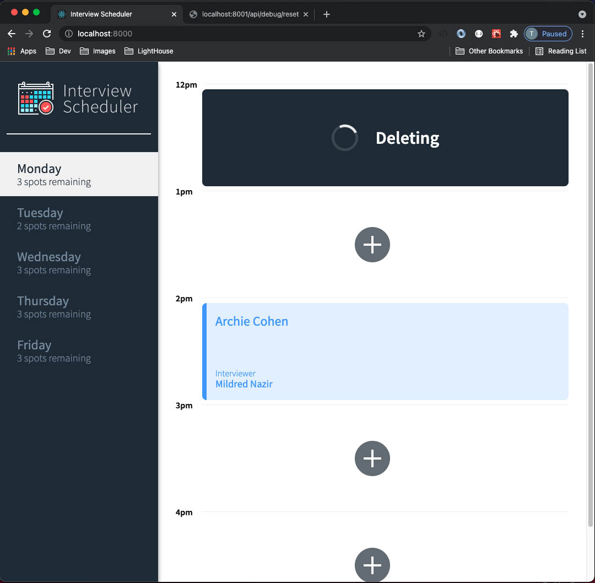
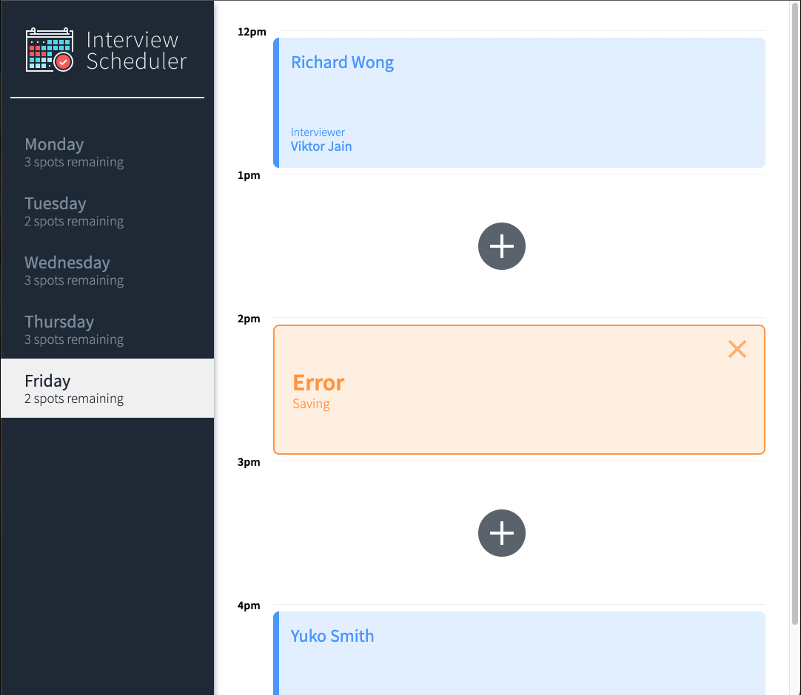

# Interview Scheduler
Interview Scheduler is a single web application built using the JavaScript library React. It allows students to book interviews with mentors when there are interview spots available. This application has been tested with Jest and Cypress. 

To Book an appointment, click on a day with availble spots. Then click on the + icon this represents where there are available times. 
A student must leave their name and select a mentor they would like to book an appointment with. A name must be present in order to save their appointment to the database.  

If a student has made a mistake after booking the appointment, they can edit it by clicking on the pen and paper icon on the bottom right hand side of the appointment. 

If a student wants to cancel they can click the trash can icon on the bottom right hand side of the booked appointment. 

In the unlikely event that an error occurs during any of the process an error message will appear on screen. 

## Setup

Install dependencies with `npm install`.

## Running Webpack Development Server

```sh
npm start
```

## Running Jest Test Framework

```sh
npm test
```

## Running Storybook Visual Testbed

```sh
npm run storybook
```
### Final Product







